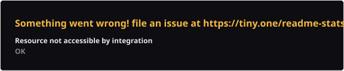

 

 

### <code>$ cat highlights.md</code>

- 📜 Co-invented and filed a patent for **AstraOrb** — a satellite-based autonomous disaster relief system with on-orbit AI and inter-satellite consensus protocols
- 💼 Software Engineering Intern @ **Orbosis Global** — cut API latency with Redis caching and automated payment verification
- ⚡ Architected systems to comfortably handle **1,000+ concurrent users** in production
- 🧩 **450+ DSA / competitive programming problems** solved across CodeChef, GeeksforGeeks & more

 

### <code>$ ls projects/</code>

**🛍️ KripaConnect**
Full-stack e-commerce platform with JWT + Google OAuth 2.0 RBAC, Redis-cached APIs, and Razorpay payments — built to comfortably serve 1,000+ concurrent users.
`Node.js` `Express` `PostgreSQL` `Redis` `Razorpay` `OAuth 2.0`

**🎬 Creolink**
Real-time collaborative video project-management platform with an Adobe Premiere Pro (UXP) plugin, a WebSocket engine, and Upstash Redis read-through caching with anti-stampede protection.
`Next.js` `PostgreSQL` `WebSockets` `Redis` `Adobe UXP`

**🧭 [HireCompass](https://hirecompass.vercel.app)**
AI-powered job application tracker with a Kanban pipeline and AI-generated outreach & cover letters, plus a React Native companion app.
`React` `Node.js` `Gemini API` `Groq` `React Native`

**🐞 BugForge**
Real-time project management & bug-tracking tool, containerized and deployed with Docker/Nginx.
`Next.js 15` `Express` `Socket.IO` `Docker` `Nginx`

 

### <code>$ cat stack.json</code>

<b>Languages</b>
 

        

<b>Frontend & Mobile</b>
 

         

<b>Backend</b>
 

      

<b>Databases</b>
 

 

<b>Cloud, Hosting & DevOps</b>
 

      

<b>Tools & Design</b>
 

   

 

### <code>$ git log --stats</code>

<!-- stats/top-langs/streak are self-hosted — generated by .github/workflows/profile-cards.yml
     and committed into this repo. They'll show broken until that workflow runs once.
     Trophy stays live (github-profile-trophy.vercel.app), styled to match the palette. -->

 

### <code>$ ./contribution-snake.sh</code>

<!-- Self-hosted via .github/workflows/snake.yml, published to the `output` branch. -->

<picture>
  <source media="(prefers-color-scheme: dark)" srcset="https://raw.githubusercontent.com/imkunal01/imkunal01/output/github-contribution-grid-snake-dark.svg" />
  <source media="(prefers-color-scheme: light)" srcset="https://raw.githubusercontent.com/imkunal01/imkunal01/output/github-contribution-grid-snake.svg" />
  
</picture>

